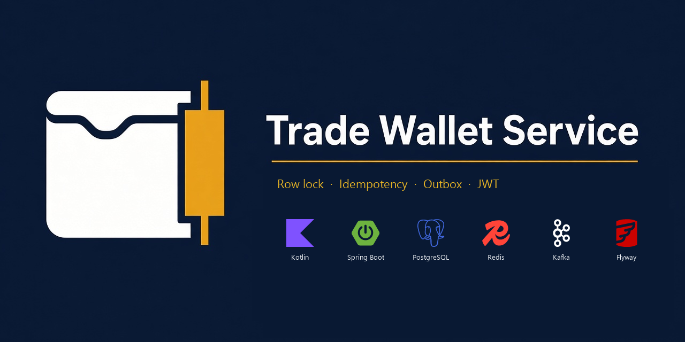
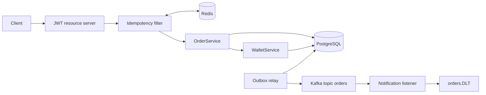

# Trade Wallet Service



Kotlin service that reserves trading funds when an order is placed, rejects lost updates, and publishes `OrderCreatedEvent` only after the database commit. Duplicate client retries return the original order instead of reserving twice.

An order is a reservation plus an event. Matching and execution are out of scope.

## Architecture



One `POST /api/v1/orders` does three things in a single database transaction:

1. `SELECT … FOR UPDATE` on the user's wallet, then increase `reservedAmount` by `price * quantity`.
2. Insert the order. `(user_id, idempotency_key)` is unique.
3. Insert an outbox row with the JSON event. Kafka is not called here.

After commit, a scheduled relay publishes unpublished rows. The message key is the order id, so events for one order stay in order. The listener acknowledges per record. A poison payload (`symbol = FAIL-DLT`) is retried three times and then written to `orders.DLT`.

A retried POST is answered from Redis when the response is still cached. If Redis was flushed, the unique key still returns the existing order and does not reserve again. A second request that arrives while the first is running gets `409 IDEMPOTENCY_IN_PROGRESS`.

`PATCH` of a pending order carries the client's `version`. Hibernate updates with `WHERE version = ?`. A stale version is `409 OPTIMISTIC_LOCK` and does not change the wallet. A successful price change reserves or releases the difference `(newPrice - oldPrice) * quantity` in the same transaction.

## Technologies

| Technology | Role |
|---|---|
| Kotlin 2.3, Java 21, Spring Boot 4.1 | Application runtime |
| Spring Web MVC | REST API |
| Spring Security OAuth2 resource server | Stateless JWT (HS256) on every route except token and health |
| Spring Data JPA / Hibernate | Persistence, `PESSIMISTIC_WRITE` on the wallet, `@Version` on the order |
| PostgreSQL 16 | Wallets, orders, outbox. Flyway owns the schema |
| Redis 7 | Idempotency cache: `SET NX` plus TTL. Not the source of truth |
| Apache Kafka (KRaft) | `orders` topic and `orders.DLT` |
| Spring `@Scheduled` | Outbox relay. Each publish uses `REQUIRES_NEW` |
| Bean Validation | Request constraints |
| JUnit 5, MockK, Google Truth, Testcontainers | Unit tests and integration tests against real Postgres, Redis, and Kafka |

## API

Demo users: `alice` / `password`, `bob` / `password`. Each wallet starts at **10 000 USD**.

| Method | Path | Auth | Behavior |
|---|---|---|---|
| POST | `/api/v1/auth/token` | no | `{ "username", "password" }` → access token |
| GET | `/api/v1/wallets/me` | JWT | balance, reserved, available |
| POST | `/api/v1/wallets/me/credit` | JWT | demo top-up |
| POST | `/api/v1/orders` | JWT | requires `X-Idempotency-Key`. Reserves funds and returns 201 |
| GET | `/api/v1/orders/{id}` | JWT | that user's order |
| PATCH | `/api/v1/orders/{id}` | JWT | pending orders only; body includes `version` |
| GET | `/actuator/health` | no | liveness |

| Status | Code | When |
|---|---|---|
| 409 | `OPTIMISTIC_LOCK` | PATCH used an old `version` |
| 409 | `IDEMPOTENCY_IN_PROGRESS` | same key is already running |
| 422 | `INSUFFICIENT_FUNDS` | reservation would exceed available balance |
| 400 | `MISSING_HEADER` | `POST /orders` without `X-Idempotency-Key` |
| 400 | `BAD_REQUEST` | order is not `PENDING`, or release amount is invalid |

```bash
TOKEN=$(curl -s -X POST http://localhost:8080/api/v1/auth/token \
  -H 'Content-Type: application/json' \
  -d '{"username":"alice","password":"password"}' | jq -r .accessToken)

curl http://localhost:8080/api/v1/wallets/me \
  -H "Authorization: Bearer $TOKEN"

curl -X POST http://localhost:8080/api/v1/orders \
  -H "Authorization: Bearer $TOKEN" \
  -H "Content-Type: application/json" \
  -H "X-Idempotency-Key: $(uuidgen)" \
  -d '{"symbol":"AAPL","price":150.00,"quantity":2}'
```

## Run locally

Gradle downloads a JDK 21 toolchain (Foojay). On Windows, `run-local.bat` starts the infrastructure and then the app.

Infrastructure only, app on the host with profile `local`:

```bash
docker compose up postgres redis kafka kafka-ui
./gradlew bootRun
```

App and infrastructure together:

```bash
docker compose up --build
```

| | |
|---|---|
| API | http://localhost:8080 |
| Kafka UI | http://localhost:8081 |
| Postgres | `localhost:5432`, db `tradewallet`, user `trade`, password `trade` |
| Kafka from the host | `localhost:9092` |
| Kafka from other containers | `kafka:19092` |

Tests need Docker:

```bash
./gradlew test
```

## Layout

```
cz.cernilovsky.tradewalletservice
  config/        security filter chain, Kafka topics, DLT error handler, typed properties
  common/        API errors and exception mapping
  security/      demo token endpoint
  wallet/        balance, pessimistic reservation
  order/         create and versioned update
  outbox/        enqueue in the request transaction, relay after commit
  messaging/     OrderCreatedEvent and the notification listener
  idempotency/   Redis store and the filter registered after JWT authentication
```
