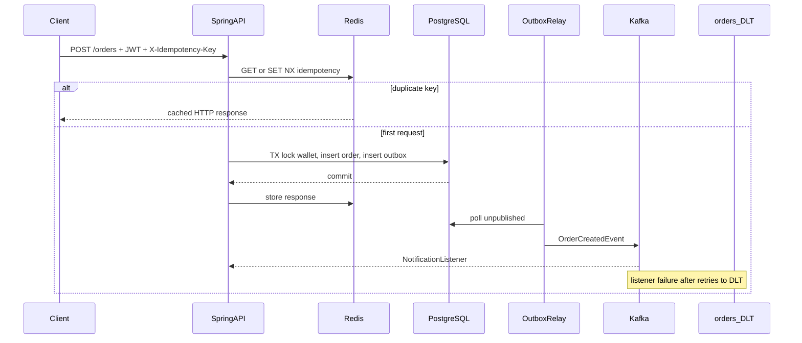

# Trade Wallet Service

Kotlin / Spring Boot 4 service that models a **trading wallet**: reserve funds when an order is placed, detect concurrent order edits, publish domain events reliably, and reject duplicate client retries.

Built as a public portfolio project for senior backend interviews (locking, outbox, Kafka, idempotency). Matching is intentionally out of scope — an order reserves money and emits `OrderCreatedEvent`.

## Stack

- Java 21, Kotlin 2.3, Spring Boot 4.1
- Spring Web MVC, Spring Data JPA, Bean Validation
- PostgreSQL 16 + Flyway
- Redis 7 (idempotency response cache)
- Apache Kafka (KRaft, no ZooKeeper) + transactional outbox
- Spring Security (JWT HS256 resource server)
- JUnit 5, MockK, Testcontainers

## Architecture



Two layers of idempotency (say this in interviews):

1. **Redis** — fast replay of the original HTTP body (`SET NX` + TTL).
2. **PostgreSQL** — `UNIQUE (user_id, idempotency_key)` on `orders`, written in the **same transaction** as the wallet reservation and outbox row. Redis is not the source of truth.

Outbox exists because `KafkaTemplate.send` inside `@Transactional` is a classic failure mode: the broker and the database do not share a commit.

## API

Demo users: `alice` / `password`, `bob` / `password`. Seed wallets: **10 000 USD**.

| Method | Path | Auth | Notes |
|--------|------|------|--------|
| POST | `/api/v1/auth/token` | no | `{ "username", "password" }` |
| GET | `/api/v1/wallets/me` | JWT | balance, reserved, available |
| POST | `/api/v1/wallets/me/credit` | JWT | demo top-up |
| POST | `/api/v1/orders` | JWT | requires `X-Idempotency-Key` |
| GET | `/api/v1/orders/{id}` | JWT | |
| PATCH | `/api/v1/orders/{id}` | JWT | body must include `version` |
| GET | `/actuator/health` | no | |

Until the learning TODOs are implemented, create/update order return **HTTP 501**.

### Example

```bash
TOKEN=$(curl -s -X POST http://localhost:8080/api/v1/auth/token \
  -H 'Content-Type: application/json' \
  -d '{"username":"alice","password":"password"}' | jq -r .accessToken)

curl http://localhost:8080/api/v1/wallets/me \
  -H "Authorization: Bearer $TOKEN"

curl -X POST http://localhost:8080/api/v1/orders \
  -H "Authorization: Bearer $TOKEN" \
  -H "Content-Type: application/json" \
  -H "X-Idempotency-Key: $(uuidgen)" \
  -d '{"symbol":"AAPL","price":150.00,"quantity":2}'
```

## Run locally

Gradle downloads a **JDK 21** toolchain automatically (Foojay resolver). A newer JDK on the machine (for example Android Studio's JBR) is fine.

Infrastructure only (app on the host with profile `local`):

```bash
docker compose up postgres redis kafka kafka-ui
./gradlew bootRun
```

Everything, including the app:

```bash
docker compose up --build
```

- API: <http://localhost:8080>
- Kafka UI: <http://localhost:8081>
- Postgres: `localhost:5432` / `trade` / `trade` / db `tradewallet`
- Kafka from the host: `localhost:9092` (from other containers: `kafka:19092`)

Tests (Docker required for Testcontainers):

```bash
./gradlew test
```

## Learning path

Business methods are left as `TODO(learning)` so you implement the interview-relevant parts. Follow this order; each class has detailed KDoc.

1. **Pessimistic locking** — `WalletRepository`, `WalletService.reserve`, then `OrderService.create` (wallet + order in one `@Transactional`). Test: `WalletServiceTest`, `WalletConcurrencyIT`.
2. **Optimistic locking** — `@Version` on `OrderEntity`, `OrderService.update`, HTTP 409 in `GlobalExceptionHandler`. Test: `OrderOptimisticLockIT`.
3. **Outbox + Kafka + DLT** — `OutboxService.enqueue`, `OutboxRelay`, `@KafkaListener` on `OrderCreatedNotificationListener`. Test: `OutboxIT`.
4. **Idempotency** — `RedisIdempotencyStore`, `IdempotencyFilter` (register **after** the JWT filter), unique key already in Flyway. Test: `IdempotencyIT`.
5. **Enable the IT classes** — remove `@Disabled` and fill assertions.

Do **not** send to Kafka from `OrderService`. Do **not** lock with `@Version` on the wallet (wrong tool). Do **not** treat Redis as the only duplicate guard.

## Interview notes

| Topic | What this repo demonstrates |
|--------|-----------------------------|
| `PESSIMISTIC_WRITE` | `SELECT … FOR UPDATE` on the wallet row; second TX waits; used for **balance invariants**. |
| `@Version` | `UPDATE … WHERE version = ?`; 0 rows → `OptimisticLockingFailureException` → **HTTP 409**; used for **lost updates** on orders. |
| `@Transactional` | `REQUIRED` for order+wallet+outbox; `REQUIRES_NEW` per outbox row in the relay so a Kafka failure does not undo a previous publish. |
| Outbox | Event row commits with the aggregate; relay publishes after commit; at-least-once (consumers must be idempotent). |
| Kafka | Partition key = `orderId`; record ack-mode; poison messages after 3 retries go to `orders.DLT`. |
| Idempotency | Redis `SET NX` for replay; DB unique constraint for correctness after cache loss. |

## Layout

```
cz.cernilovsky.tradewalletservice
  config/          Security, Kafka topics + DLT error handler, typed properties
  common/          API errors, exception handler (409 left for you)
  wallet/          Entity, repository, service, controller
  order/           Entity, repository, service, controller
  outbox/          Entity, enqueue service, scheduled relay
  messaging/       OrderCreatedEvent, notification listener stub
  idempotency/     Redis store + filter stubs
  security/        Demo JWT token endpoint
```

## What is deliberately unfinished

`WalletService.reserve`, `OrderService.create` / `update`, outbox publish loop, Kafka listener, idempotency filter/store, 409 mapping, and the integration test bodies. That is the learning core, not missing product work.
